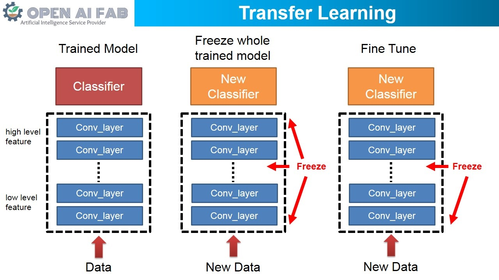
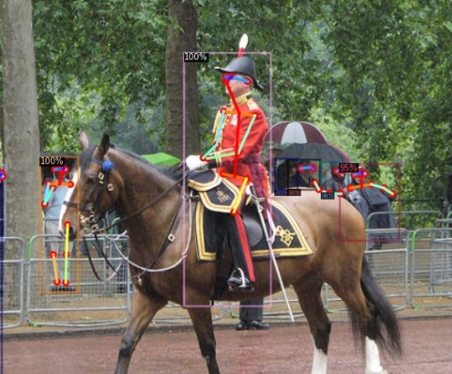
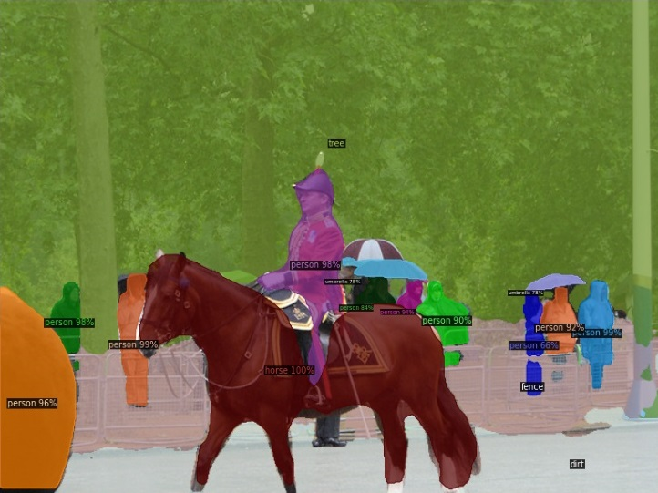
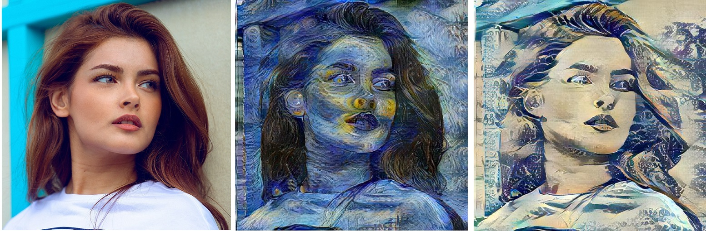

# Computer Vision Tasks
CV Tasks 包含Classification、Object Detection、Semantic Segmentation、Instance Segmentation，以下為一些應用範例。
### 01 keras-facenet.ipynb
此範例說明如何使用Pre-trained的model來做Face Verification和Face Recognition應用。[1]  
### 02 Mask R-CNN for Object Detection.ipynb
此範例說明如何用Pre-trained的Mask RCNN來做Object Detection和Instance Segmentation。[2]  
### 03 Transfer Learning by TensorFlow.ipynb
此範例說明如何用TensorFlow內建的Pre-trained model來做Classification的Transfer Learning應用。[3]  
  
### 04 retrain customized object detection with tensorflow API.ipynb
此範例說明如何用TensorFlow API訓練自己的Object Detection應用。[4]  
### 05 retrain semantic segmentation.ipynb
此範例說明如何使用Pre-trained的model來訓練自己的Semantic Segmentation應用。[5]  
### 06 detectron2.ipynb
此範例說明如何使用Detectron2(Pre-trained model)來做Object Detection、Instance Segmentation、Keypoint Detection、Panoptic segmentation。  
Keypoint Detection為體態辨識。[6]  
  
Panoptic segmentation為instance segmentation和semantic segmentation的結合。在圖中可以被數數量出來的物件 (例：bicycle, dog, car, person)被稱為‘things’，難以被計數的區域(例：pavement, ground, dirt, wall)稱為‘stuff’。[7]  
  
### 07 U-Net segmentation.ipynb
此範例說明如何使用U-Net來訓練自己的Semantic Segmentation應用。[8]  
### 08 Style Transfer.ipynb
此範例介紹圖片Style Transfer應用，輸入原圖和風格圖即可將原圖改變風格。[9]  

### 09 retrain Poly-YOLO.ipynb
此範例說明如何使用Poly-YOLO來訓練自己的Object Detection應用。[10]  
### 10 retrain YOLOv5.ipynb
此範例說明如何使用YOLOv5來訓練自己的Object Detection應用。[11]  

## References
[1] https://github.com/nyoki-mtl/keras-facenet  
[2] https://github.com/matterport/Mask_RCNN  
[3] https://www.tensorflow.org/tutorials/images/transfer_learning  
[4] https://github.com/EdjeElectronics/TensorFlow-Object-Detection-API-Tutorial-Train-Multiple-Objects-Windows-10  
[5] https://github.com/GeorgeSeif/Semantic-Segmentation-Suite.git  
[6] https://github.com/facebookresearch/detectron2  
[7] https://medium.com/@danielmechea/what-is-panoptic-segmentation-and-why-you-should-care-7f6c953d2a6a  
[8] https://github.com/qubvel/segmentation_models  
[9] https://github.com/GlebBrykin/SANET  
[10] https://gitlab.com/irafm-ai/poly-yolo  
[11] https://github.com/ultralytics/yolov5  
